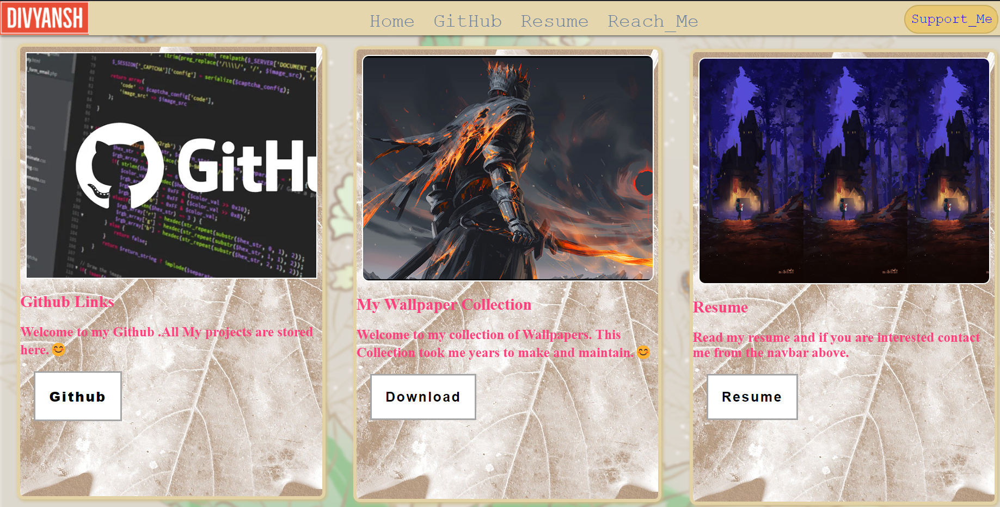

# WEB DEVELOPMENT PRACTICE

<!-- [](LICENSE) -->

## Description

hi. this is my personal repo on which i play with html, css and js. frameworks used will have thier own folders . This is pure html, css and js. 😊


## Table of Contents

- [Installation](#installation)
- [Usage](#usage)
- [Features](#features)
- [Contributing](#contributing)

## Installation

Clone and run. 😊

```bash
$ git clone https://github.com/ggrambler/WebDevPractice.git
# $ cd yourproject
# $ npm install
